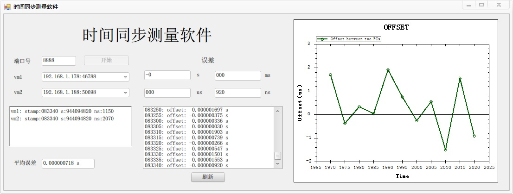

# SyncMeasureProject

一个TCP服务器，用于接收多台计算机上的TCP客户端约定相同时间定时发送的TimeStamp。
从而计算其时间误差并将其可视化。
TCP客户端见Linux程序`TimeTools/Timer/tcp_client.c`，其目录下的README.md文件有客户端程序的详细使用说明。

> 环境准备

Windows平台和.NET Framework 4.5框架

> 程序界面

> 安装和使用

1. 双击SyncMeasureProject.ext文件即可打开程序界面。
   注意ZedGraph.dll动态库文件应和exe文件位于同一目录下。

2. 打开界面后点击界面标题下方的`开始`按钮即可启动TCP服务器，等待TCP客户端的连接。
   默认端口号为8888，若出现冲突也可自行设置端口号再点击`开始`按钮。

3. 分别点击vm1和vm2右侧的下拉菜单选择所要观察比较的两个终端。
   注意不要选择相同的两个终端。

4. `刷新`按钮上方的数据为两个终端的时间误差，可滚动回看历史数据。
   鼠标选中时会悬停在当前位置，点击`刷新`按钮会重新滚动显示最新数据。

5. 右侧的折线图用鼠标点击选中后，滚动鼠标滚轮可进行缩放。注意缩放时容易失去焦点。
   也可一直按住鼠标左键然后拖动选择某一个矩形区域进行缩放。
   折线图Y轴Offset的单位为微秒(us)。